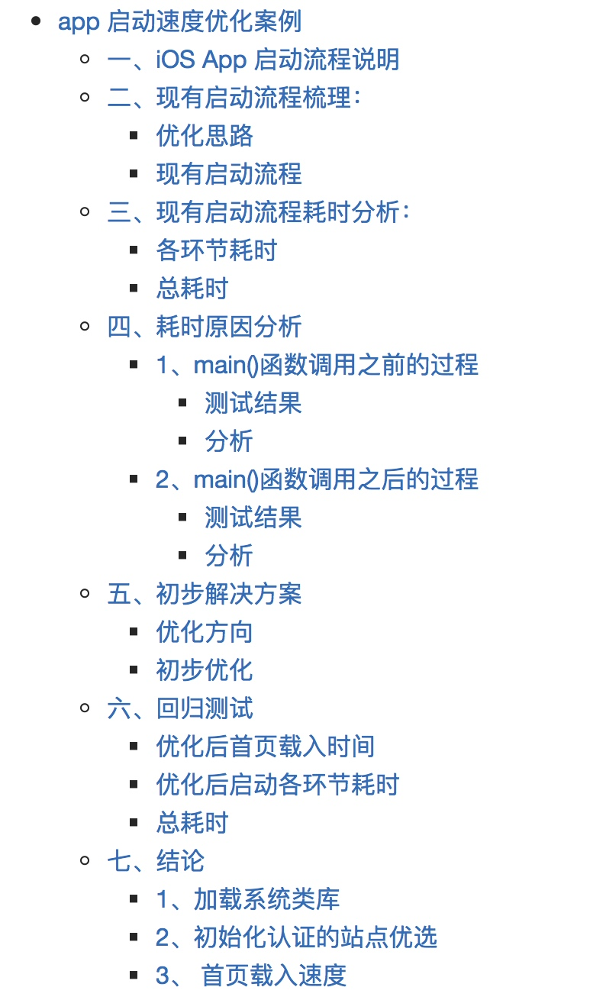
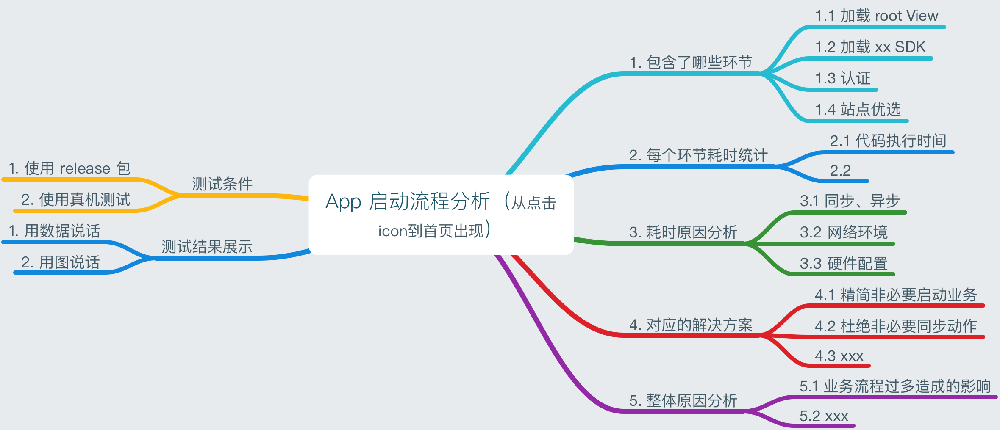
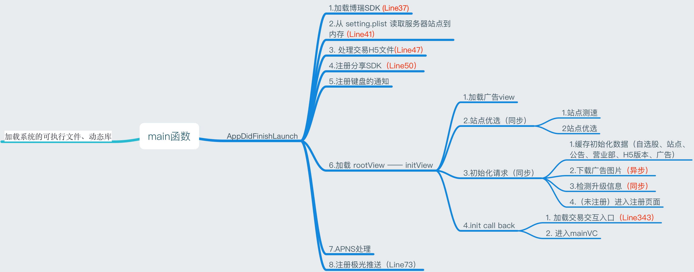
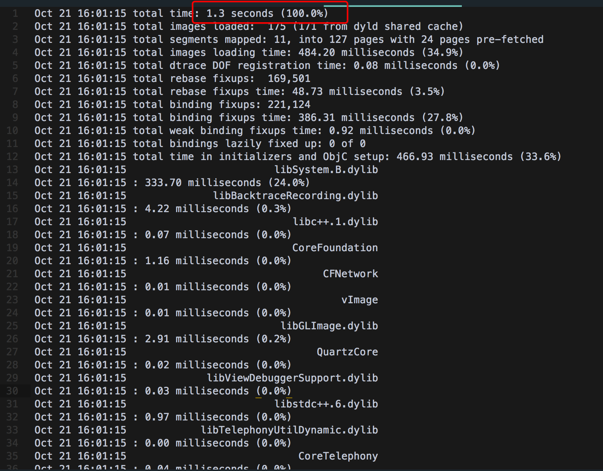
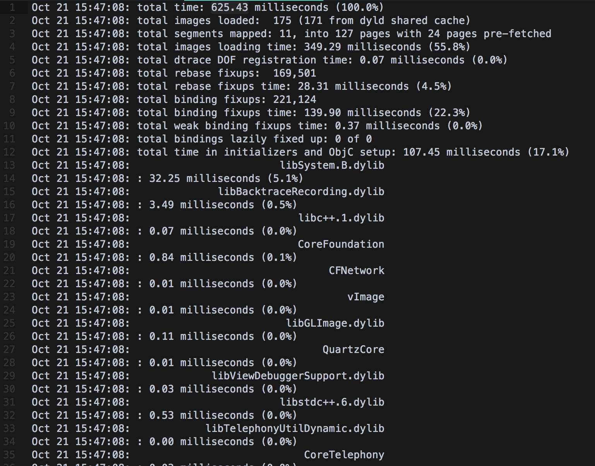
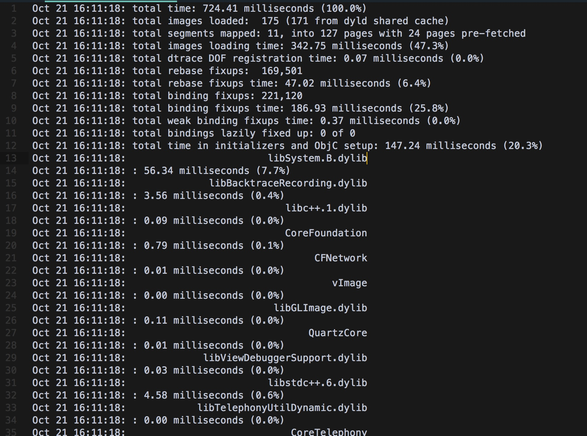
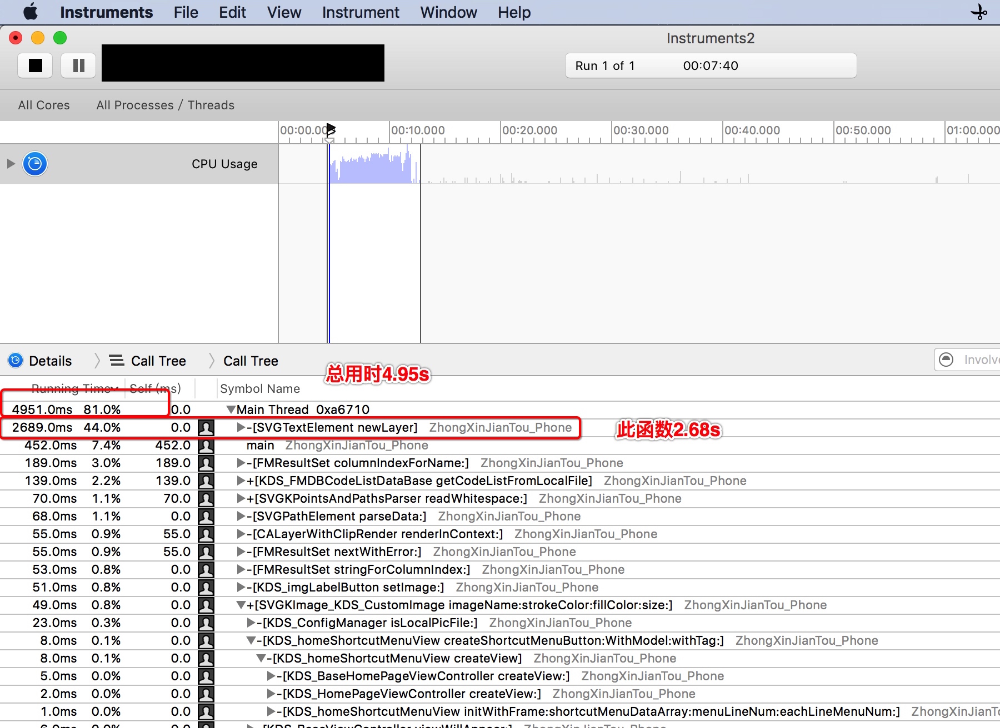
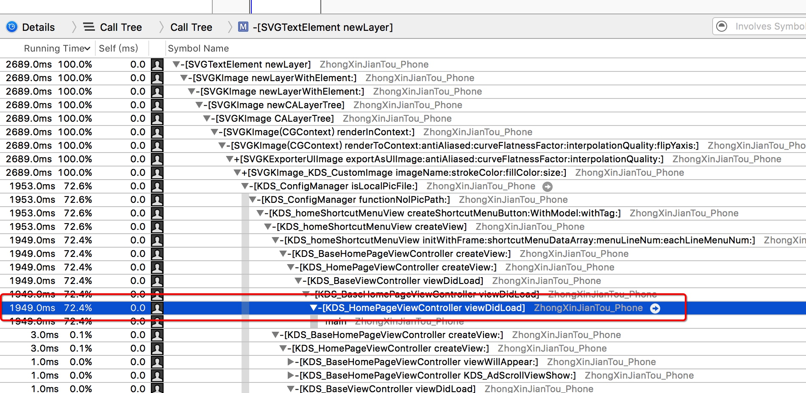
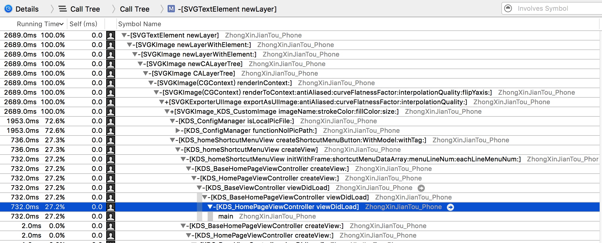
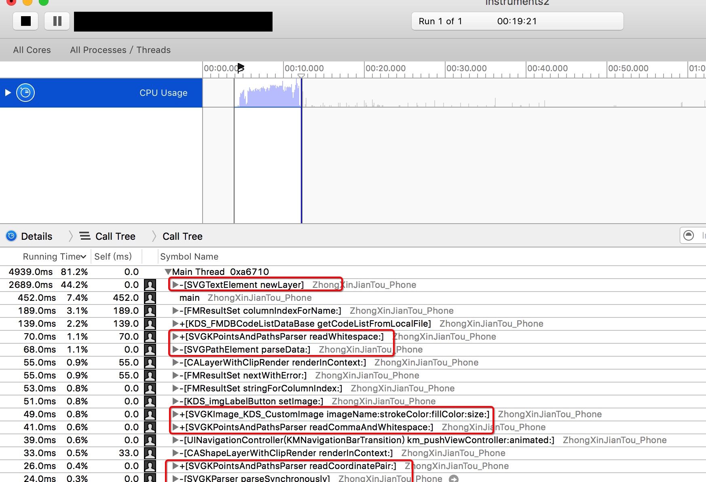

#app 启动速度优化案例

##一、iOS App 启动流程说明
OS App 的启动过程可分为 main() 函数之前部分和 main() 函数之后部分。之前的部分主要工作是加载可执行文件和动态库(dylib)，而之后的工作是构建第一个界面，并完成渲染展示。

App 测量耗时的方法分为热启动(warm launch)和冷启动(cold launch)。 热启动的时候由于系统核心缓存中有之前加载的动态库，所以会快于冷启动；而冷启动是指的是每次都重启设备后进行的启动，通常取冷启动的时长作为测量数据。

##二、现有启动流程梳理：
###优化思路
在着手开始整理 App 启动速度优化方案前，先制定了优化的一个思路

###现有启动流程
通过对现有业务的梳理，对代码进行 debug 分析，整理出现有的启动流程如下：

##三、现有启动流程耗时分析：

<a href="http://one9398.com/2016/08/28/WWDC%E4%B9%8B%E4%BC%98%E5%8C%96App%E5%90%AF%E5%8A%A8%E9%80%9F%E5%BA%A6/">WWDC之优化App启动速度</a>

各环节耗时
<pre><code>2016-10-23 22:49:57.941 - main.m - main 函数 - 第 18 行：  **Launched0 in 0.000007 sec**
2016-10-23 22:49:58.910 - AppDelegate.m - -[AppDelegate application:didFinishLaunchingWithOptions:] 函数 - 第 38 行：  **Launched1 in 0.968879 sec**
1、从点击 icon 到 app launch 耗时： 0.96s

2016-10-23 22:49:59.071 - AppDelegate.m - -[AppDelegate application:didFinishLaunchingWithOptions:] 函数 - 第 67 行：  **Launched2 in 1.129960 sec**
2016-10-23 22:49:59.097 - AppDelegate.m - -[AppDelegate application:didFinishLaunchingWithOptions:] 函数 - 第 83 行：  **Launched3 in 1.155645 sec**
2、从 app launch 到 finish launch 耗时： 0.96s

2016-10-23 22:50:01.023 - AppDelegate.m - -[AppDelegate initViewControllerComplete] 函数 - 第 351 行：  **Launched4 in 3.081724 sec**
2016-10-23 22:50:01.155 - AppDelegate.m - -[AppDelegate initViewControllerComplete] 函数 - 第 359 行：  **Launched5 in 3.213866 sec**
3、从 finish launch 到初始化完成 耗时： 2.06s

2016-10-23 22:50:01.165 - KDS_MainViewController.m - -
[KDS_MainViewController createView:] 函数 - 第 108 行：  **Launched6 in 3.223383 sec**
2016-10-23 22:50:01.509 - KDS_MainViewController.m - -[KDS_MainViewController createView:] 函数 - 第 124 行：  **Launched7 in 3.567582 sec**
2016-10-23 22:50:05.646 - KDS_MainViewController.m - -[KDS_MainViewController viewDidAppear:] 函数 - 第 60 行：  **Launched8 in 7.704637 sec**
4、从 初始化完成 到 首页出现 耗时： 2.06s

</code></pre>

总耗时

以上环节总耗时 7.7s

##四、耗时原因分析

###1、main()函数调用之前的过程

####测试结果
三次测试结果如下：

####分析
原因分析：以上时间为系统加载可执行文件、动态库的时间，平均耗时在 0.86s 左右

测试方式参考： <a href="http://one9398.com/2016/08/28/WWDC%E4%B9%8B%E4%BC%98%E5%8C%96App%E5%90%AF%E5%8A%A8%E9%80%9F%E5%BA%A6/">WWDC之优化App启动速度</a>

###2、main()函数调用之后的过程
####测试结果
使用工具 Instruments 进行 TimeProfile 分析，发现以下现象：

并定位到耗时最多的函数为：

并且，在加载首页过程中，耗时前 15 的函数，SVG 相关的有 7 个，占 45% 的时间 :

